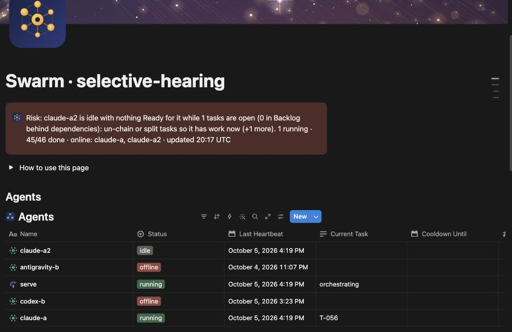
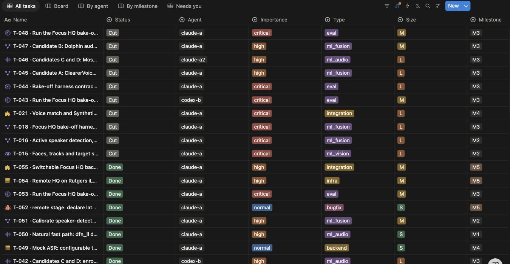
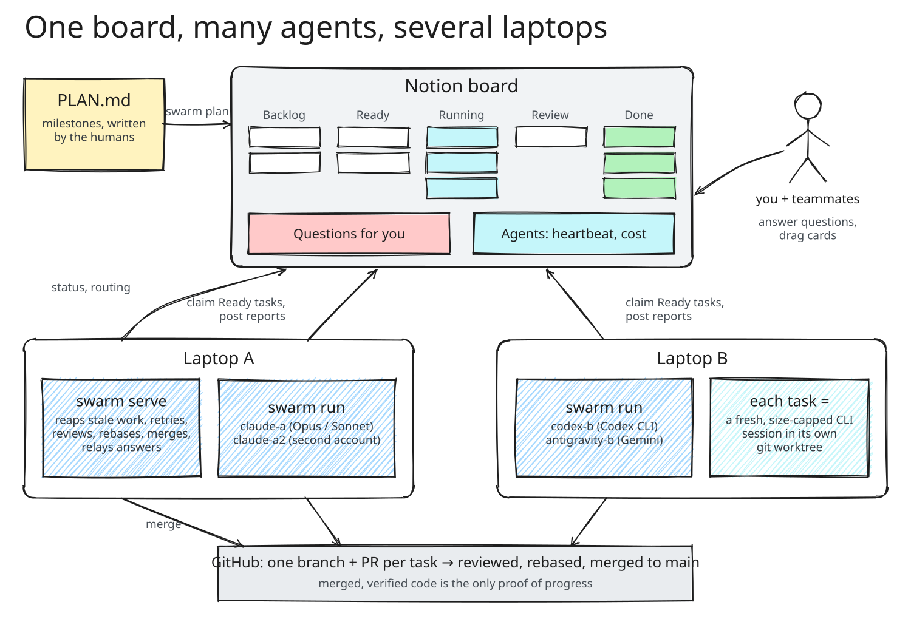
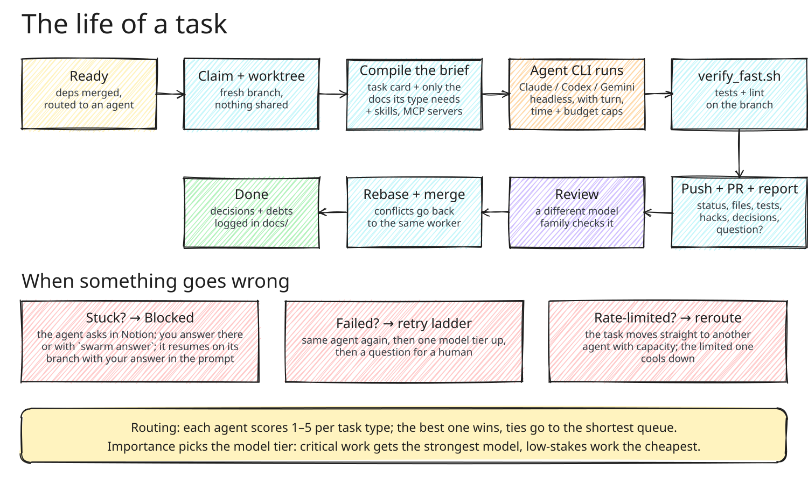
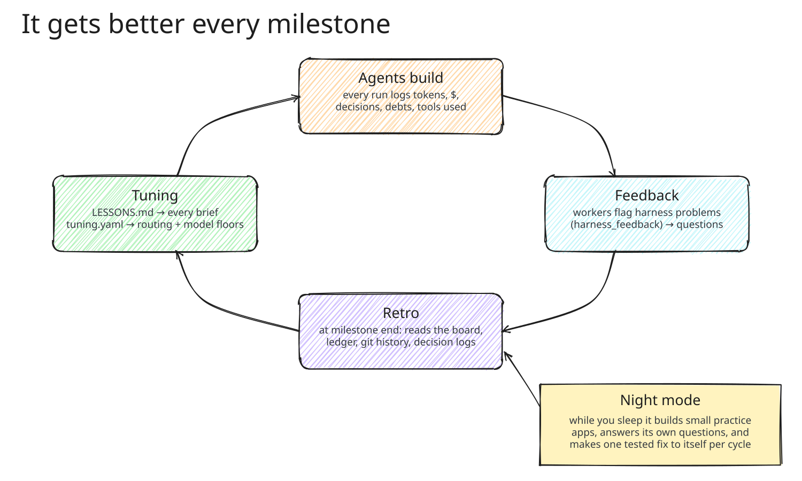

<div align="center">


# swarm-control

**Run a team of AI coding agents in parallel across several laptops, from one Notion board.**

Claude Code, Codex, Gemini, Antigravity and Grok each take tasks from a shared board, work in their own git worktree,
and open verified pull requests. A control loop reviews, merges, retries, reroutes around rate limits, and asks a human
only when it has to.


</div>

> Agents execute autonomously in fresh, bounded contexts.
> Humans own intent through Notion.
> Merged, verified code is the only proof of progress.

## Why

One giant AI coding session is slow, burns its whole context on unrelated files, and stops dead when its subscription
hits a rate limit. A team with two laptops and a few AI subscriptions has far more capacity than that, but no way to
point it all at one plan.

swarm-control turns a written plan into small, independent tasks and hands each one to the best available agent in a
**fresh, size-capped session**. Cheap work goes to cheap models; critical work gets the strongest one. Every task ends
as a reviewed, tested pull request, and the humans steer from a Notion board instead of babysitting terminals.

## In action

swarm-control was built for **HackRU Fall 2026** as the tool our team uses to build its hackathon project,
*selective-hearing* (a real-time speech-isolation and captioning engine). This is the real board from that run:

<table>
<tr>
<td width="44%"></td>
<td width="56%"></td>
</tr>
<tr>
<td align="center"><sub>The real dashboard mid-run: a live status line written by <code>swarm serve</code>, and each agent's heartbeat and current task</sub></td>
<td align="center"><sub>The Tasks board: every task with the agent it was routed to, its importance, type, size and milestone</sub></td>
</tr>
</table>

## How it works



1. **`PLAN.md` is the product.** `swarm plan` turns a milestone of it into tasks with a type, importance, size, file
   scope and dependencies, and creates them on the Notion board.
2. **A router picks the agent and the model.** Each agent scores 1–5 per task type; importance picks the model tier.
3. **`swarm run` on every laptop** claims its agents' Ready tasks, makes a git worktree, compiles a prompt from the task
   card and *only* the docs that task type needs, runs the agent CLI headless with turn, time and budget caps, runs
   `verify_fast.sh`, pushes, opens a PR and posts a structured report to the card.
4. **`swarm serve` on one laptop** reaps stale work, retries failures one model tier up, reviews important work with a
   different model family, rebases and merges, promotes tasks whose dependencies merged, reroutes around rate limits,
   and keeps a live status page on the board.
5. **Humans steer from Notion.** Blocked agents ask in a Questions table; you answer there (or `swarm answer`) and the
   task resumes on its branch with your answer in the prompt. You can drag cards to reassign or reprioritise.



### It learns from its own runs



When a milestone finishes, `swarm serve` runs a **retro**: it reads the board, the usage ledger, `main`'s history and
every task's decision log, then writes `docs/LESSONS.md` (included in every future brief and plan) and
`.swarm/tuning.yaml` (safe config changes, such as raising a task type's model floor when a cheap model keeps running
out of turns). Workers can also flag problems with the harness itself in their report, which become questions for the
orchestrator.

## Quick start

Requirements: Python 3.11+, `git`, the GitHub CLI `gh` (logged in), a Notion internal-integration token, and the agent
CLIs you want to use (`claude`, `codex`, `gemini`, `agy`, `grok`, or anything else through the generic adapter).

```bash
git clone https://github.com/aryanpatel142006/swarm-control.git && cd swarm-control
python3 -m venv .venv && source .venv/bin/activate && pip install -e ".[dev]"
pytest                                             # green with no setup: Notion, git and CLIs are faked

export NOTION_TOKEN=ntn_...                        # your Notion integration token
export SWARM_HOST=laptop-a                         # this laptop's name in config.hosts

swarm template ../myproject && cd ../myproject     # scaffold a project repo
# edit .swarm/config.yaml: agents, hosts, models, strengths
swarm init --parent-page <notion page id>          # builds the board, dashboards and views
swarm doctor && swarm doctor --smoke claude-a      # checks tokens, CLIs, gh, verify scripts; one-turn smoke run
swarm plan PLAN.md --milestone M1                  # propose tasks, then create them
caffeinate -i swarm serve                          # on ONE laptop
caffeinate -dims swarm run                         # on every laptop
swarm status                                       # any time
```

### A teammate joining from a second laptop

1. Clone and install as above, then get the Notion token from a teammate privately (never through git or chat logs) and
   put it in your shell profile with your laptop's name from the project's `.swarm/config.yaml`.
2. Accept the invite to the project repo, clone it next to swarm-control, and run `swarm doctor` inside it, then
   `swarm tools --install` (installs the plugins the project's config asks for, plus Playwright's browser). On a Codex
   laptop also register the config's MCP servers with `codex mcp add` ([RUNBOOK](docs/RUNBOOK.md), step 7).
3. `swarm doctor --smoke <your agent>` once per agent you'll run.
4. `caffeinate -dims swarm run` and leave it. Only one laptop runs `swarm serve`.

Idle runners keep themselves current: they fetch this repo, fast-forward and restart, so nobody has to pull by hand.

## Commands

| Command | What it does |
|---|---|
| `swarm template <dir>` | Scaffold a project repo: config, verify scripts, skills, agent docs |
| `swarm init` | Build the Notion dashboard, Tasks board, Questions and Agents tables with their views |
| `swarm doctor` | Check tokens, CLIs, `gh`, verify scripts, doc references, sleep settings; `--smoke` runs one turn; `--models` probes model ids |
| `swarm plan` / `apply-proposals` | Turn a milestone of `PLAN.md` into tasks; apply a saved proposal |
| `swarm run` | Work this laptop's agents' tasks |
| `swarm serve` | The control loop: reap, retry, review, merge, promote, reroute, status |
| `swarm status` / `logs` / `usage` | What's happening, a task's logs, tokens and cost per agent |
| `swarm answer` / `tell` | Answer a blocked task; send a note to a task's next attempt |
| `swarm add` / `assign` / `split` / `cut` / `reroute` | Edit the plan from the terminal |
| `swarm handoff` / `restart` | Move a task between agents; drain and restart a runner safely |
| `swarm retro` / `night` | Run a retro now; run unattended practice cycles |
| `swarm tools` / `agents-sync` | Show and install plugins, skills, MCP servers; sync the Agents table with config |

## Reference

<details>
<summary><b>Task statuses</b></summary>

`Backlog → Ready → Running → Review → Merge Ready → Done`, plus `Changes Requested` (verify failed, reviewer findings or
a rebase conflict; the same worker resumes), `Blocked` (waiting on a question), `Failed` (retry ladder: same agent, one
tier up, then a question) and `Cut`.
</details>

<details>
<summary><b>Routing</b></summary>

`agents.<name>.strengths` is a 1–5 score per task type; the highest wins, ties go to the shortest queue, then the
cheaper provider. `routing.importance_to_tier` maps importance to a model tier; `type_model_overrides` encodes
evidence-based exceptions (for example, critical frontend work runs on the model that measured best at frontend).
Idle agents steal work from saturated ones, a returning agent triggers a redistribution, and a rate-limited agent's
tasks move straight to another agent with capacity. Override any task with `swarm assign`, or drag its card in Notion.
</details>

<details>
<summary><b>Toolbox: plugins, skills and MCP servers per task</b></summary>

Workers get the tools their task type needs and nothing else, on every CLI:

- **Plugins (Claude Code).** `plugins_required` are installed on every laptop (`swarm tools --install`, checked by
  `swarm doctor`). `plugins_by_type` are loaded for one run with `--plugin-dir`; every other enabled plugin is switched
  off for the run, which halved a worker's base context (measured 7.6k → 3.9k tokens).
- **Skills.** `swarm template` vendors skills into the project's `.claude/skills` (`.agents/skills` symlinks there for
  Codex). `skills_by_type` / `skills_by_importance` name the ones a brief tells the worker to use.
- **MCP servers.** `mcp_by_type` / `mcp_by_importance` / `agents.<name>.mcp` pick servers per run: Claude gets exactly
  those via `--mcp-config … --strict-mcp-config`; Codex enables servers registered with `codex mcp add`.
- **Feedback loop.** Every report lists the tools used and whether they helped; the harness writes that into the task's
  decision log, so after a few tasks you can see which tools earn their context.
</details>

<details>
<summary><b>Unattended practice runs</b></summary>

`caffeinate -dims swarm night --cycles 6` runs practice cycles while you're away: each adds one small app to `PLAN.md`
as a new milestone (Notecard, Quizlet-mini, Kanban-mini, Pomodoro-log…), lets every online agent build it, answers
blocking questions itself, waits for the retro, and logs the cycle to `docs/night/`. Unless you pass `--no-improve`,
each log goes to a fresh session that makes one tested change to the harness on a `night/<n>` branch, merged only when
the suite is green. Keep the laptop plugged in with the lid open; `swarm doctor` warns if it can sleep.
</details>

<details>
<summary><b>Adding a provider</b></summary>

Use `provider: generic` with a `command_template` such as
`mycli --prompt-file {prompt_file} --model {model} --cwd {cwd}`. The model must write its report to
`.swarm-run/report.json`. For a first-class adapter, subclass `swarm.adapters.base.Adapter`
(see [`swarm/adapters/`](swarm/adapters/) for Claude, Codex, Gemini, Antigravity and Grok).
</details>

<details>
<summary><b>Testing</b></summary>

`pytest` runs unit tests, adapter tests against a fake CLI, and an end-to-end run against an in-memory board and a
temporary git remote. `SWARM_NOTION_TOKEN=... SWARM_NOTION_PARENT=... pytest tests/test_notion_integration.py` exercises
a real Notion page.
</details>

## Project structure

```
swarm/
├── cli.py               every `swarm` command
├── planner.py           PLAN.md milestone → tasks (type, importance, size, scope, deps)
├── router.py, policy.py which agent and which model tier
├── runner.py            claim → worktree → prompt → agent CLI → verify → PR → report
├── serve.py             the control loop: reap, retry, review, merge, promote, reroute
├── reviewer.py, merge.py cross-family review, rebase and merge
├── relay.py             questions and answers between agents and humans
├── retro.py, night.py   self-improvement and unattended practice cycles
├── usage.py             token and cost ledger, caps and cooldowns
├── adapters/            claude, codex, gemini, antigravity, grok, generic
├── board/               Notion (and an in-memory board for tests)
└── template/            what `swarm template` scaffolds
docs/
├── RUNBOOK.md           game-day steps
├── field-notes/         every incident from the real run, and what was changed
├── night/, rehearsals/  logs from practice runs
└── superpowers/specs/   the original design spec
```

## Docs

- Design spec: [`docs/superpowers/specs/2026-09-26-swarm-control-design.md`](docs/superpowers/specs/2026-09-26-swarm-control-design.md)
- Visual plan: [`docs/plan-visual/SWARM_CONTROL_Plan.pdf`](docs/plan-visual/SWARM_CONTROL_Plan.pdf)
- Game day: [`docs/RUNBOOK.md`](docs/RUNBOOK.md)
- Orchestrator session: [`ORCHESTRATOR.md`](ORCHESTRATOR.md) and the [orchestrator skill](skills/swarm-control/SKILL.md)
- Field notes from the real run: [`docs/field-notes/`](docs/field-notes/)

---

Built by [Aryan Patel](https://github.com/aryanpatel142006) for HackRU Fall 2026. swarm-control is a development tool,
not the hackathon project itself.
